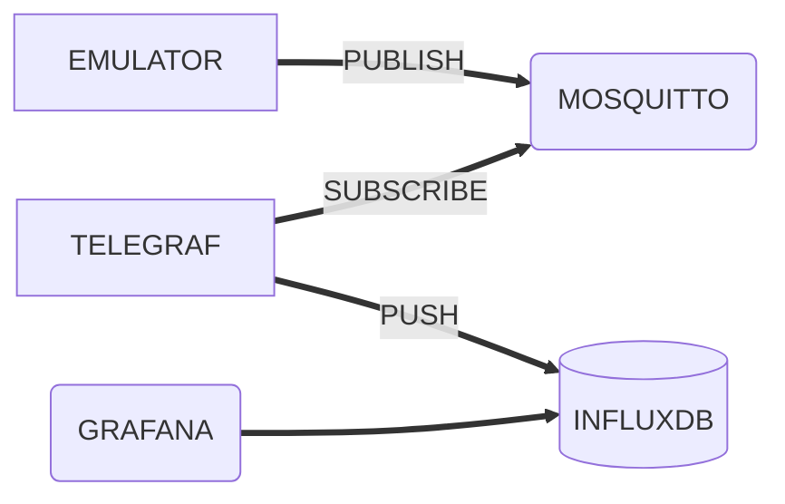

# TP OPERACIONES : IoT

El siguiente trabajo practico requiere el despliegue de una solucion IoT que consta de los siguientes componentes

## GRAFANA , InfluxDB , MOSQUITTO y Telegraf

- Grafana: Intrface web para generar paneles de control | dashboards conectado a una base de datos InfluxDB 

- InfluxDB: Base de datos de serie de tiempo

- Mosquitto : Broker de mensajes que implementa el protocolo MQTT 
  adicionalmente una instancia de node-exporter que provee datos de monitoreo de
  hardware

- Telegraf permite integrar MQTT e InfluxDB, basicamente inserta los mensajes de MQTT en la base de datos InfluxDB

- Emulador python: Script de python que sirve para emular carga de dispositivos IoT 

## 

# Requerimientos

Armar
un despliegue declarativo (con docker-compose) llamado docker-compose.yaml , almacenado en GitHub que contenga todos los elementos Grafana,
InfluxDB y nodeexporter interconectados y configurados.

**Grafana:**

- Versión 9.5.2 [Imagen en Docker Hub](https://hub.docker.com/r/grafana/grafana-oss)

- Configurar todos los parámetros necesarios utilizando variables de entorno

- El despliegue debe incluir el origen de datos o data source a InfluxDB ya definido

- NO ES NECESARIO IMPLEMENTAR HTTPS , PERO SI ES
  UN PLUS EN LA NOTA

**InfluxDB:**

- Deben utilizar una versión compatible con Grafana pero que tenga la mayor cantidad de tiempo de soporte posible [Imagen en Docker Hub](https://hub.docker.com/_/influxdb)

- Los datos deben ser persistidos incluso si se destruye el contenedor

- LOS ARCHIVOS DE BASE DE DATOS NO DEBEN ESTAR PERSISTIDOS EN EL REPOSITORIO GIT

**Documentación:** Se debe incluir un README.md con los datos necesarios para ingresar a la aplicación también un diagrama de la solucion , pueden usar https://www.drawio.com/ que se integra a GitHub. Se debe incluir en el repositorio de GitHub todos los archivos necesarios para inicializar el despliegue.

## Seguimiento del TP

Se recomienda crear el repositorio de GitHub lo antes posible es parte de la evaluación de este trabajo la anticipación y dedicación que pongan en el mismo. La anticipación le permite a el/los docentes realizar correcciones y seguimiento tempranos.

## Verificación del TP

Los pasos realizados por la persona evaluadora serán los siguientes

1. Clonar el repositorio git clone <<REPO URL>>

2. Posicionarse en el directorio del repositorio y ejecutar el comando `docker-compose up -d`

3. Ingresar a Grafana

4. Ingresar Grafana y explorar los datos del datasource InfluxDB

**Adicionalmente el profesor puede realizar preguntas adicionales a los integrantes del grupo para determinar la nota final**
